> # 这是一个基于SSM框架实现的界面美观，功能完整的论坛。分为[用户系统](http://182.61.136.218:8080/BBS_SSM)和[管理员系统](http://182.61.136.218:8080/BBS_SSM/admin)两部分
> > 1，用户登录用户系统后可以发帖（需要管理员审核通过后才能在首页显示，但可以在“我的主页”查看帖子状态）、修改帖子、删除帖子、评论、删除评论、修改个人信息、关注他人、收藏帖子。
> >
> > 2，管理员登录管理员系统后可以管理用户（查看用户、删除用户信息）、管理帖子（查看帖子、审核帖子信息）、管理板块（新增板块、修改板块、删除板块信息）、访问记录。
> ### 版本更新
> > 1，整体更新为异步实现
> >
> > 2，增加和优化人机交互提示
> >
> > 3，实现分页，减少页面加载时间，提升效率
> ## 技术栈
> > **Spring** 、**SpringMVC** 、**MyBatis** 、**MySQL**  、**Bootstrap** 、**jQuery** 、**Ajax** 、**Layer**、**ECharts**
>
> > ### 我的环境
>
> > **jdk1.8** 、**tomcat9** 、**mysql6.3** 、**maven3.5.4** 、**eclipse4.7.1a**
> ## 在线演示：
> > [用户系统（手机上也有不错的展示效果）](http://182.61.136.218:8080/BBS_SSM)
>
> > [管理员系统（用户名：admin密码：......）](http://182.61.136.218:8080/BBS_SSM/admin) **↓↓↓**
>
> > > 由于总是有人随意删除他人用户信息，故暂不再开放管理员权限，望理解！
>
> > > 作者QQ：924818949
>
> ## 引用本项目流程（以eclipse为例）：
>
> > - ### 将本项目导入编辑器
> >
> > 1. 通过git将该项目(bbs-ssm)clone到本地
> >
> > 
> >
> > 2. 使用eclipse将ssm-bbs以maven的方式导入
> >
> > 
> >
> > 
> >
> > 然后等待Maven下载依赖包完成...
>
> > ### 修改项目部署路径
> >
> > 
>
> > ### 将bbs_test.sql导入MySQL数据库：
> >
> > 1. 创建数据库bbs_test：`create database bbs_test;`
> > 2. 进入bbs_test数据库：`use bbs_test;`
> > 3. 将bbs_test.sql导入bbs_test数据库：`source 你的路径\bbs_test.sql;`
>
> > ### 启动项目
> >
> > 
> >
> > 可以正常访问与操作了...真好
>
> ## 静态展示：
> ### 用户系统
> - > #### 登录
>
> > 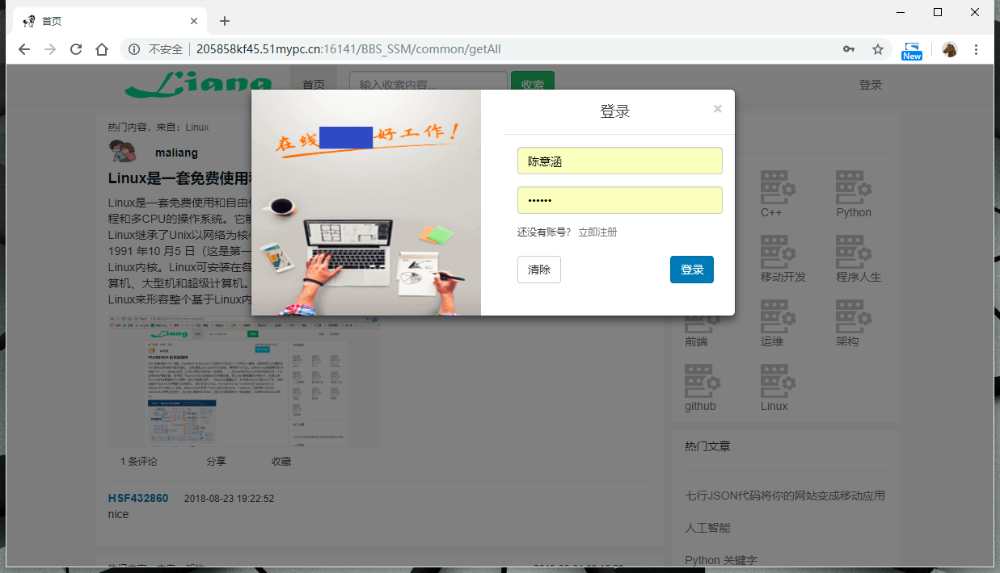
>
> - > #### 首页
>
> > 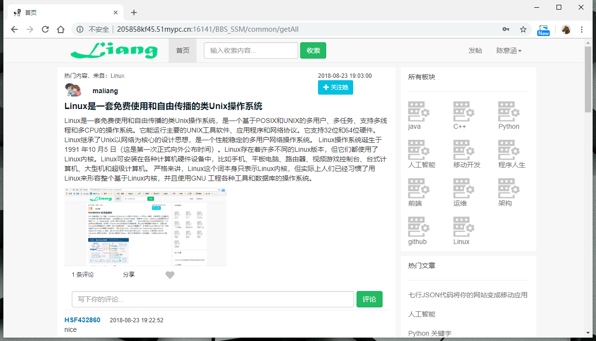
>
> - > #### 发帖
>
> > 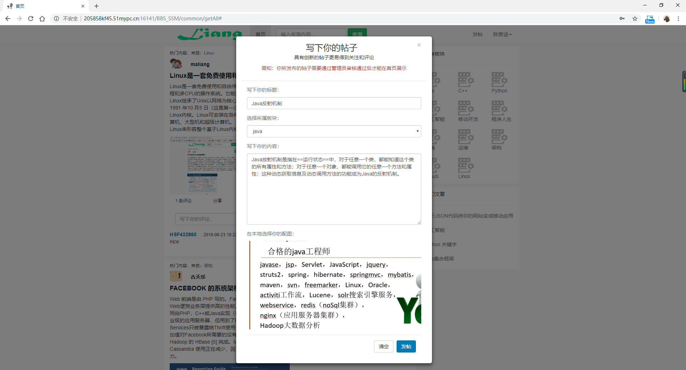
>
> - > #### 个人主页
>
> > 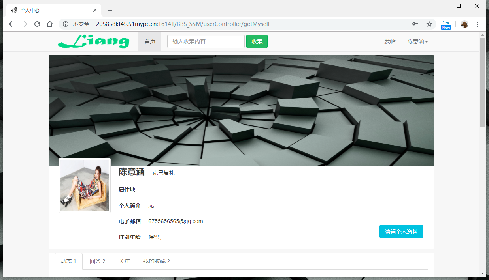
>
> - > #### 编辑个人资料
>
> > 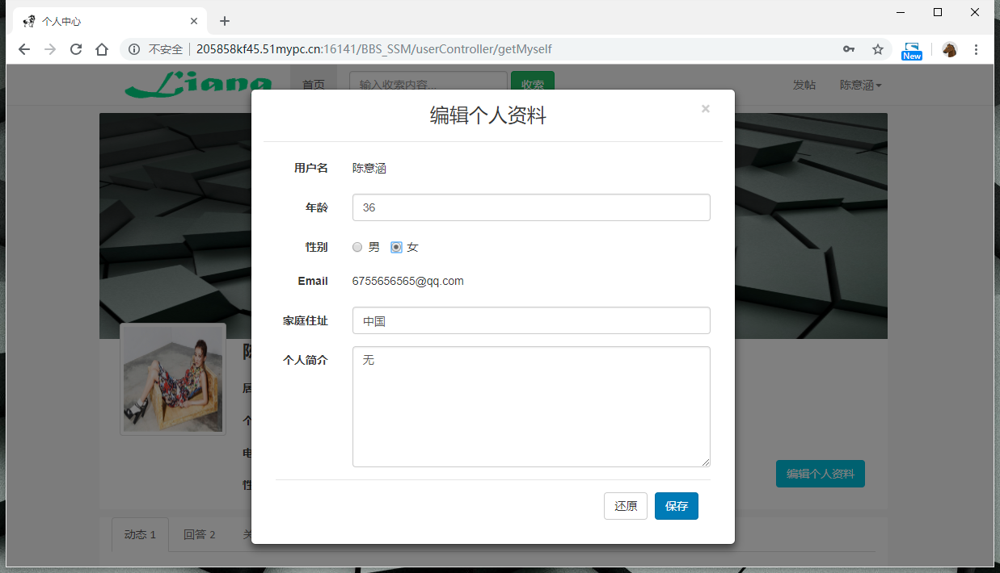
>
> - > #### 基本信息设置
>
> > 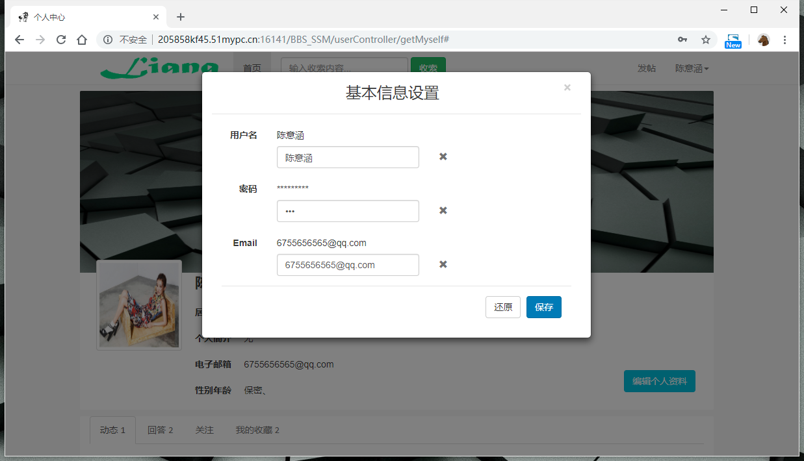
>
> - > #### 修改头像（点击头像弹出模态框）
>
> > 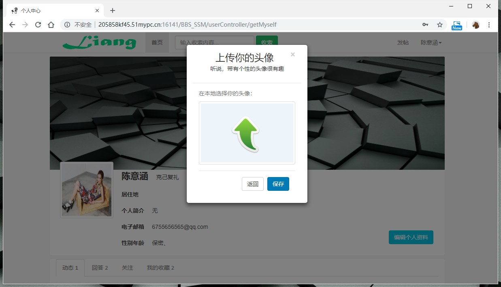
>
> - > #### 动态.回答.关注.收藏
>
> > 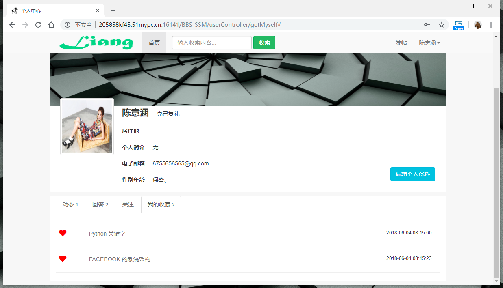
>
> ### 管理员系统
> - > #### 登录
>
> > 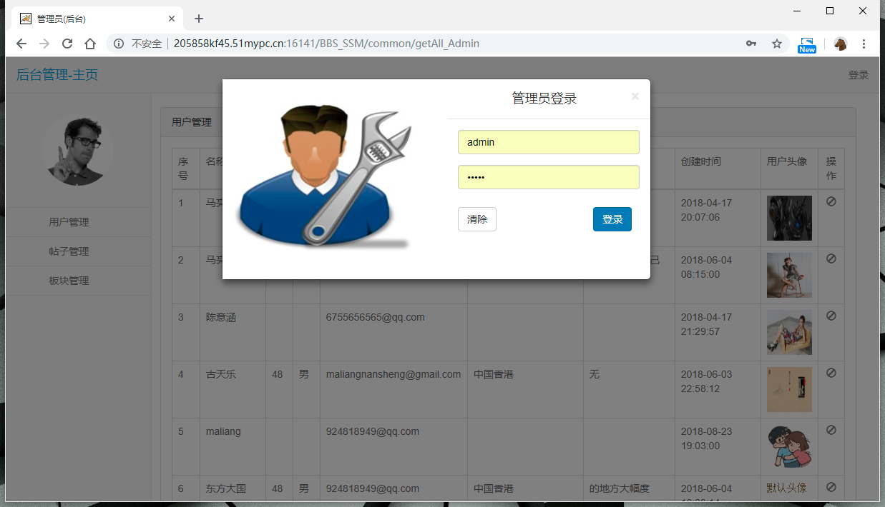
>
> - > #### 用户管理
>
> > 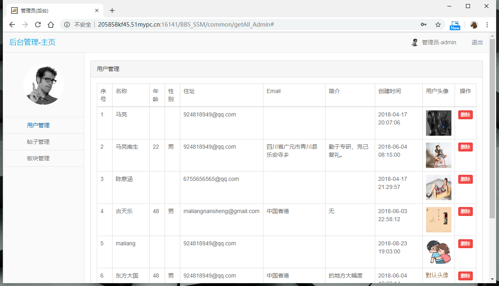
>
> - > #### 帖子管理
>
> > 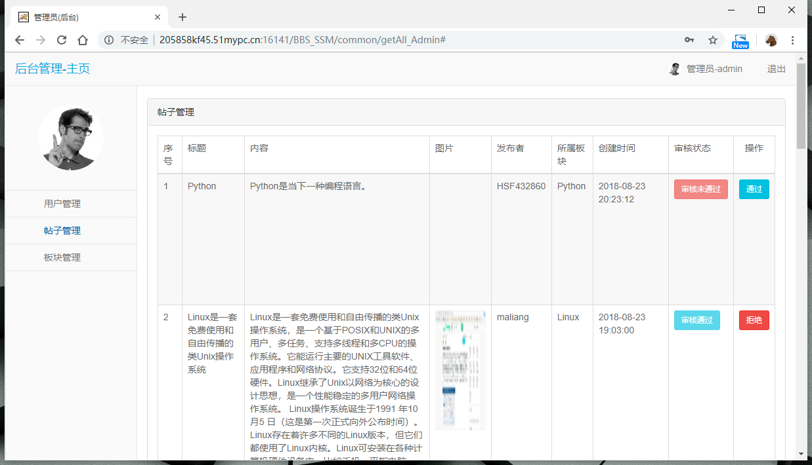
>
> - > #### 版块管理
>
> > 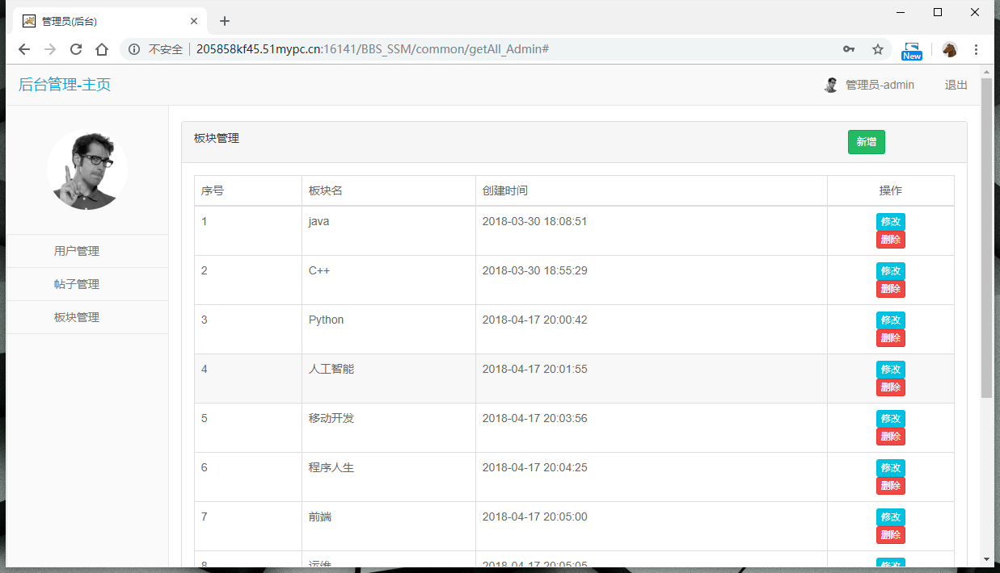
