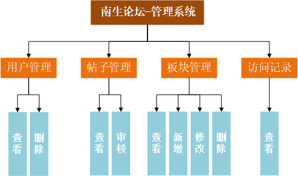
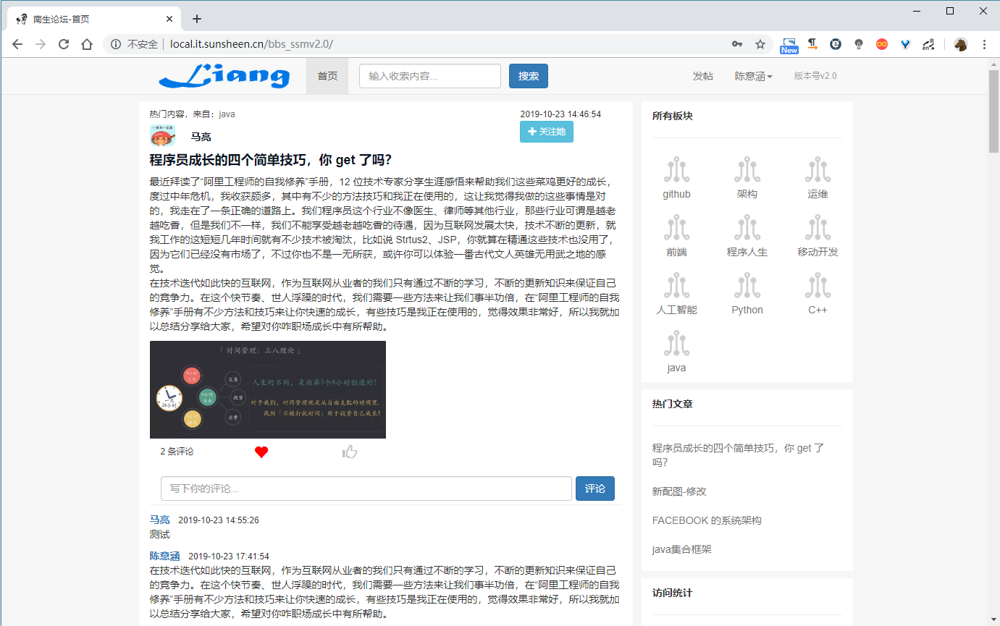

## 关于项目

- 南生论坛基于`SSM`框架，自适应手机端和电脑端，界面简洁美观，功能完善。分为[用户系统](http://www.nanshengbbs.top)和[管理系统](http://www.nanshengbbs.top/admin)两部分
- 该论坛适合`初学SSM`的同学学习。主要涉及技术包括`Spring 、SpringMVC 、MyBatis 、MySQL 、Bootstrap 、jQuery 、Ajax 、Layer、ECharts`

## 在线演示

`手机上也有不错的展示效果...`

用户系统：[http://www.nanshengbbs.top](http://www.nanshengbbs.top)

管理系统：[http://www.nanshengbbs.top/admin](http://www.nanshengbbs.top/admin)    **↓↓↓**

> 为了避免大家删除数据，暂时不给后台账号，望理解！
>
> 作者`QQ：924818949`

## 功能结构

- 用户系统-功能结构图

  

  `注：发布的帖子需要管理员“审核通”过后才能在首页显示，可以在“我的主页”查看帖子状态`

- 管理系统-功能结构图

  

## 数据库获取or疑问解答

> 需要数据库或者有疑问的同学加作者`QQ：924818949`

## 南生论坛APP

链接：[南生论坛APP 下载](https://pan.baidu.com/s/1-q_fH_gR-RLkM252CtlU-Q) 
提取码：`qz5e`

## 版本更新

- 第二次更新`v2.0`：`2019年5月25日`
  1. 整体更新为异步实现
  2. 增加和优化人机交互提示
  3. 实现分页，减少页面加载时间，提升效率

- 首次提交`v1.0`：`2018年8月4日`

## 下载地址

Github地址：[https://github.com/maliangnansheng/bbs-ssm](https://github.com/maliangnansheng/bbs-ssm)（如果可以帮忙点一次`Star`和`Fork`）

## 项目源码

|          |                     源码                     |
| :------: | :------------------------------------------: |
| `github` | <https://github.com/maliangnansheng/bbs-ssm> |
|  `码云`  | <https://gitee.com/maliangnansheng/bbs-ssm>  |

## 技术栈

> `Spring 、SpringMVC 、MyBatis 、MySQL 、Bootstrap 、jQuery 、Ajax 、Layer、ECharts`

## 我的环境

> `jdk1.8 、tomcat9 、mysql5.7 、maven3.5.4 、IntelliJ IDEA 2018.3 x64（eclipse4.7.1a）`

## 引用本项目流程

`推荐使用IDEA`

### 通用操作

- 通过git将该项目(bbs-ssm)`clone`到本地

  

- 将bbs_test.sql导入MySQL数据库：

  - 创建数据库bbs_test

    ```sql
    create database bbs_test;
    ```

  - 进入bbs_test数据库

    ```sql
    use bbs_test;
    ```

  - 将bbs_test.sql导入bbs_test数据库

    ```sql
    source 你的路径\bbs_test.sql;
    ```

### 针对eclipse

- 确保你安装了 Maven

  没有用过 `Maven` 的童鞋，赶快去学一下，安装一下；为了避免麻烦，请尽量使用`3.5.4 +`版本

- 使用eclipse将ssm-bbs以maven的方式导入

  

  

  等待Maven下载依赖包完成...

- 修改项目部署路径

  

- 启动项目

  

  可以正常访问与操作了...真好

### 针对idea

- IntelliJIDEA-tomcat在浏览器js乱码问题解决

  [IntelliJIDEA-tomcat在浏览器js乱码问题解决](http://blog.nanshengbbs.top:8080/2019/04/28/IntelliJIDEA-tomcat%E5%9C%A8%E6%B5%8F%E8%A7%88%E5%99%A8js%E4%B9%B1%E7%A0%81%E9%97%AE%E9%A2%98%E8%A7%A3%E5%86%B3/)

- 确保你安装了 Maven

  没有用过 `Maven` 的童鞋，赶快去学一下，安装一下；为了避免麻烦，请尽量使用`3.5.4 +`版本

- 使用idea将ssm-bbs导入

  

  点击“Enable Auto-Import”让其自动下载依赖包

  

  等待Maven下载依赖包完成...

- 修改项目部署路径

  

  

- 启动项目

  

  可以正常访问与操作了...真好

## 静态展示

### 用户系统

- **登录**

  

  `手机上的效果：`

  

- **注册**

  

  `手机上的效果：`

  

- **首页-登录前**

  

  `手机上的效果：`

  

  [查看全部](http://blog.nanshengbbs.top:8080/2019/12/19/%E5%8D%97%E7%94%9F%E8%AE%BA%E5%9D%9B%E9%A1%B5%E9%9D%A2%E9%9D%99%E6%80%81%E5%B1%95%E7%A4%BA/)

<<<<<<< HEAD
  **↓↓↓↓↓↓↓↓↓↓↓↓↓↓↓↓↓↓↓↓↓↓↓↓↓↓↓↓↓↓↓↓↓↓↓↓↓↓↓↓↓↓↓↓↓↓↓↓↓↓↓↓↓↓↓↓↓↓↓↓↓↓↓**

  [前往查看南生论坛所有页面的展示效果：](http://blog.nanshengbbs.top:8080/2019/12/19/%E5%8D%97%E7%94%9F%E8%AE%BA%E5%9D%9B%E9%A1%B5%E9%9D%A2%E9%9D%99%E6%80%81%E5%B1%95%E7%A4%BA/)


=======
  

  `手机上的效果：`

  

[查看全部](http://blog.nanshengbbs.top:8080/2019/12/19/%E5%8D%97%E7%94%9F%E8%AE%BA%E5%9D%9B%E9%A1%B5%E9%9D%A2%E9%9D%99%E6%80%81%E5%B1%95%E7%A4%BA/)

**↓↓↓↓↓↓↓↓↓↓↓↓↓↓↓↓↓↓↓↓↓↓↓↓↓↓↓↓↓↓↓↓↓↓↓↓↓↓↓↓↓↓↓↓↓↓↓↓↓↓↓↓↓↓↓↓↓↓↓↓↓↓↓**

[前往查看南生论坛所有页面的展示效果：](http://blog.nanshengbbs.top:8080/2019/12/19/%E5%8D%97%E7%94%9F%E8%AE%BA%E5%9D%9B%E9%A1%B5%E9%9D%A2%E9%9D%99%E6%80%81%E5%B1%95%E7%A4%BA/)